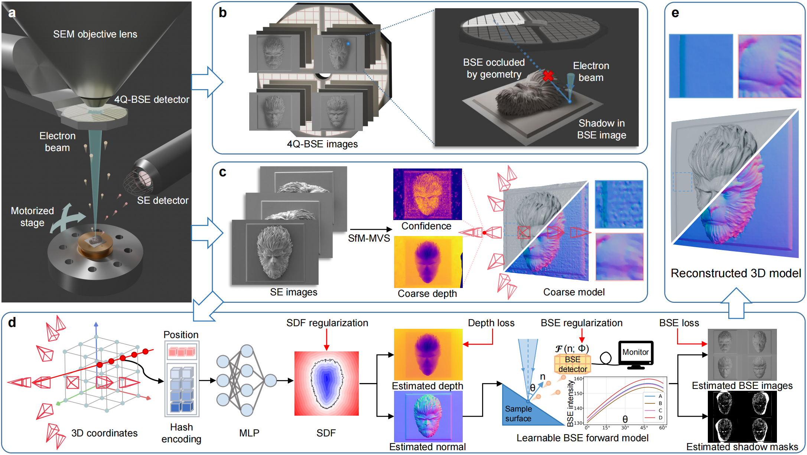
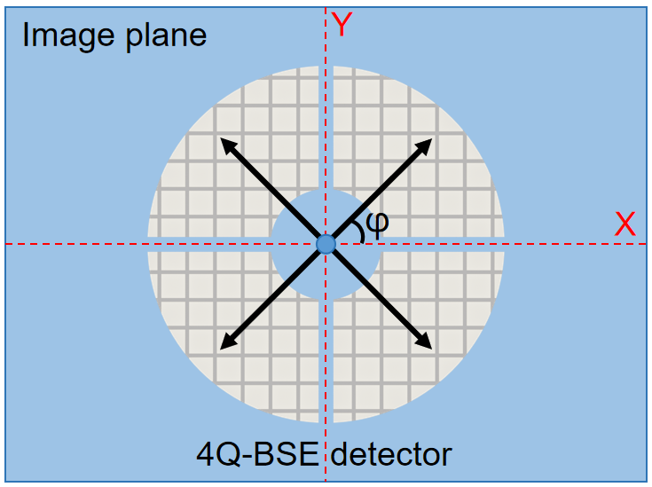
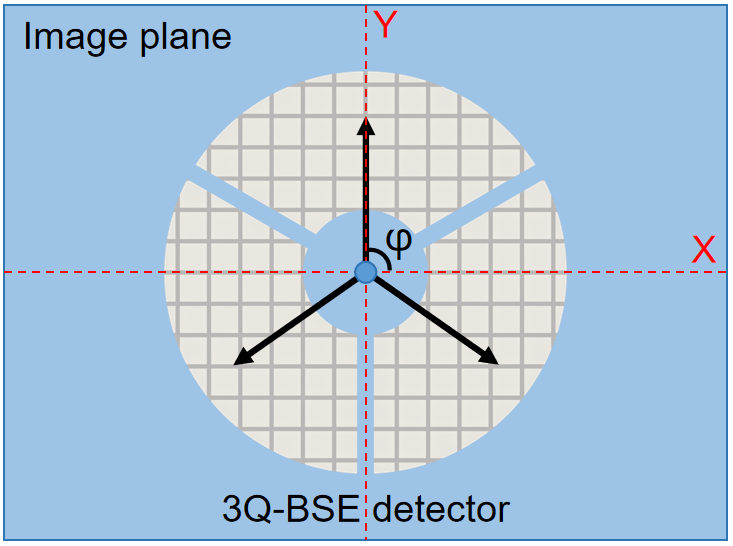

# NFH-SEM: Neural Field-Based 3D Surface Reconstruction of Microstructures from Multi-Detector Signals in Scanning Electron Microscopy
## CVPR 2026 Oral

## [Paper](https://arxiv.org/abs/2508.04728) | [Video](https://youtu.be/ionPVaKpMvU) | [Dataset](https://www.dropbox.com/scl/fi/wk95ejq89zznum53en4hn/NFH-SEM.rar?rlkey=vy5hw4yj4g94zadvrffo34nhx&st=yaanca1x&dl=0)

**In this repository, we provide NFH-SEM, an SEM 3D surface reconstruction framework designed to reconstruct complex microstructures from multi-view, multi-detector 2D SEM images.**

<p align="center">

</p>

---
## NFH-SEM Dataset
We collected a multi-view, multi-detector SEM dataset covering various samples with diverse geometric characteristics. The dataset includes complex microstructures fabricated using the two-photon lithography (TPL) technique, as well as peach pollen and SiC particle surfaces. The data was acquired using a [ZEISS Gemini 560 SEM system](https://www.zeiss.com/microscopy/en/products/sem-fib-sem/sem/geminisem-family.html). Each sample consists of 37 scans from different viewing angles. For each viewpoint, one secondary electron (SE) image was captured using an Everhart-Thornley detector, and four backscattered electron (BSE) images were acquired using a pneumatically retractable BSE detector.

To the best of our knowledge, this is the first multi-detector SEM dataset for 3D surface reconstruction of microstructures. The complete dataset will be released after the formal publication of our paper, and we hope it will encourage broader participation from the computer vision community in advancing SEM 3D reconstruction research. Our [dataset](https://www.dropbox.com/scl/fi/wk95ejq89zznum53en4hn/NFH-SEM.rar?rlkey=vy5hw4yj4g94zadvrffo34nhx&st=yaanca1x&dl=0) is available for download. You can place it in the **load/** folder.

<p align="center">
 
</p>

These are NFH-SEM reconstruction results of a Wukong model (~300 μm, fabricated via TPL) and a peach pollen grain (~40 μm).

## Preparation of Custom SEM Dataset
To perform NFH-SEM on your own samples, please follow the data acquisition steps in the **Multi-View and Multi-Detector SEM Imaging** section of our [paper](https://arxiv.org/abs/2508.04728). Use [Agisoft Metashape](https://www.agisoft.com/downloads/installer/) to run Structure-from-Motion on the multi-view SE images. Save the resulting depth maps, confidence maps, and camera poses as **.npz** files in the **camera/** folder. The multi-view BSE images from each quadrant of the 4Q-BSE detector should be placed in the Q1 to Q4 folders, respectively. The final directory structure should look as follows:

```
└── Sample name
    └── camera
        ├── 001.npz (top-view)
        ...
        └── N.npz (side-view) 
    ├── Q1 (BSE quadrant1)
        ├── 001.png (top-view)
        ...
        └── N.png (side-view) 
    ├── Q2 (BSE quadrant2)
    ├── Q3 (BSE quadrant3)
    └── Q4 (BSE quadrant4)
```

## Installation
Install NFH-SEM and set up a Conda environment with PyTorch >= 1.10.
```
git clone https://github.com/zju3dv/NFH-SEM.git
cd NFH-SEM
pip install git+https://github.com/NVlabs/tiny-cuda-nn/#subdirectory=bindings/torch
pip install -r requirements.txt
```


## Usage
### Training on our dataset

Set **dataset.scene** to the name of the sequence located in the **load/** folder, and then run the following command.

```
python launch.py --config configs/sem.yaml --gpu 0 --train dataset.scene=wukong tag=reconstruction 
```
Taking Wukong as an example, the reconstruction results will be saved in the **exp/wukong/reconstruction/save** directory.
This training process takes about 2 minutes on an NVIDIA RTX 4090 GPU.

### Training on datasets acquired from other SEM systems

<p align="center">
 
</p>

In our experiments, we used the ZEISS Gemini 560, which is equipped with a 4-quadrant BSE (4Q-BSE) detector, a configuration commonly found in most SEM systems. By default, NFH-SEM takes 4Q-BSE data as input.
Note that the installation angles of the BSE detectors may vary in different SEM systems. You need to provide the angle **φ** between each quadrant's center and the image plane's X-axis, as shown in the following example command.

```
python launch.py --config configs/sem.yaml --gpu 0 --train dataset.scene=${SCENE_NAME} dataset.Q1=45 dataset.Q2=135 dataset.Q3=225 dataset.Q4=315 tag=4Q_reconstruction
```

If you are using an SEM system from Thermo Fisher Scientific (formerly FEI), the system is typically equipped with a 3-quadrant BSE (3Q-BSE) detector, with 120 degrees between quadrants. NFH-SEM is compatible with this detector configuration as well. In this case, you need to specify the angles of the three quadrants and set the **is_3Q_BSE** parameter to True.

```
python launch.py --config configs/sem.yaml --gpu 0 --train dataset.scene=${SCENE_NAME} dataset.Q1=90 dataset.Q2=210 dataset.Q3=330 dataset.is_3Q_BSE=true tag=3Q_reconstruction
```
The angle setting depends on how the BSE detector is installed in your SEM system. You can obtain this angle from your SEM manufacturer.
If you are using a different type of detector, it can be easily adapted by modifying our code.


## Citation
If you find our paper, code or dataset useful in your own research, please cite us:
```
@misc{chen2025neuralfieldbased3dsurface,
      title={Neural Field-Based 3D Surface Reconstruction of Microstructures from Multi-Detector Signals in Scanning Electron Microscopy}, 
      author={Shuo Chen and Yijin Li and Xi Zheng and Guofeng Zhang},
      year={2025},
      eprint={2508.04728},
      archivePrefix={arXiv},
      primaryClass={eess.IV},
      url={https://arxiv.org/abs/2508.04728}, 
}
```

## Acknowledgements
We gratefully acknowledge [instant-nsr-pl](https://github.com/bennyguo/instant-nsr-pl) for their implementation of NeuS, and the [Edward.J Team](https://www.facebook.com/profile.php?id=61552763188488) for supporting the Wukong 3D model.
